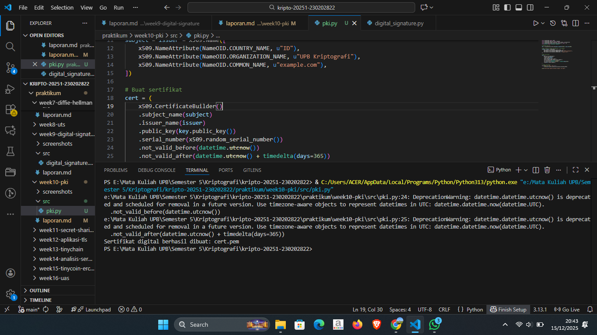

# Laporan Praktikum Kriptografi
Minggu ke-: 10  
Topik: [Public Key Infrastructure (PKI & Certificate Authority)]  
Nama: [Surya Subekti]  
NIM: [230202822]  
Kelas: [5IKRA]  

---

## 1. Tujuan
- Membuat sertifikat digital sederhana.
- Menjelaskan peran Certificate Authority (CA) dalam sistem PKI.
- Mengevaluasi fungsi PKI dalam komunikasi aman (contoh: HTTPS, TLS).


---

## 2. Dasar Teori
Public Key Infrastructure (PKI) merupakan suatu kerangka kerja keamanan yang dirancang untuk mengelola penggunaan kriptografi kunci publik dalam lingkungan digital. PKI menyediakan mekanisme untuk pembuatan, distribusi, penyimpanan, dan pencabutan sertifikat digital yang digunakan untuk menjamin keamanan komunikasi elektronik. Dengan adanya PKI, identitas suatu entitas seperti pengguna, server, atau aplikasi dapat diverifikasi secara terpercaya, sehingga pertukaran data dapat dilakukan secara aman dan terhindar dari ancaman penyadapan maupun pemalsuan identitas.

Salah satu komponen utama dalam PKI adalah Certificate Authority (CA), yaitu lembaga tepercaya yang bertugas menerbitkan dan memvalidasi sertifikat digital. CA berfungsi sebagai pihak ketiga yang menjamin keaslian identitas pemilik sertifikat dengan cara melakukan proses verifikasi sebelum sertifikat diterbitkan. Sertifikat digital yang dikeluarkan oleh CA berisi informasi penting seperti identitas pemilik, kunci publik, masa berlaku, serta tanda tangan digital dari CA itu sendiri. Dengan demikian, CA memiliki peran penting dalam membangun kepercayaan (trust) pada sistem keamanan berbasis kriptografi kunci publik.

Selain CA, PKI juga melibatkan beberapa komponen pendukung lainnya, seperti Registration Authority (RA), repository sertifikat, serta mekanisme Certificate Revocation List (CRL) atau Online Certificate Status Protocol (OCSP). RA bertugas membantu CA dalam proses verifikasi identitas pemohon sertifikat, sedangkan repository berfungsi sebagai tempat penyimpanan sertifikat yang dapat diakses publik. Sementara itu, CRL dan OCSP digunakan untuk memastikan status keabsahan sertifikat, khususnya dalam kondisi sertifikat telah dicabut sebelum masa berlakunya berakhir. Secara keseluruhan, PKI dan CA berperan penting dalam menjamin keamanan, integritas, dan kepercayaan dalam berbagai layanan digital seperti transaksi elektronik, sistem autentikasi, dan komunikasi berbasis internet.

---

## 3. Alat dan Bahan
(- Python 3.x  
- Visual Studio Code / editor lain  
- Git dan akun GitHub  
- Library tambahan (misalnya pycryptodome, jika diperlukan)  )

---

## 4. Langkah Percobaan
(Tuliskan langkah yang dilakukan sesuai instruksi.  
Contoh format:
1. Membuat file `caesar_cipher.py` di folder `praktikum/week2-cryptosystem/src/`.
2. Menyalin kode program dari panduan praktikum.
3. Menjalankan program dengan perintah `python caesar_cipher.py`.)

---

## 5. Source Code


```python
from cryptography import x509
from cryptography.x509.oid import NameOID
from cryptography.hazmat.primitives import hashes, serialization
from cryptography.hazmat.primitives.asymmetric import rsa
from datetime import datetime, timedelta

# Generate key pair
key = rsa.generate_private_key(public_exponent=65537, key_size=2048)

# Buat subject & issuer (CA sederhana = self-signed)
subject = issuer = x509.Name([
    x509.NameAttribute(NameOID.COUNTRY_NAME, u"ID"),
    x509.NameAttribute(NameOID.ORGANIZATION_NAME, u"UPB Kriptografi"),
    x509.NameAttribute(NameOID.COMMON_NAME, u"example.com"),
])

# Buat sertifikat
cert = (
    x509.CertificateBuilder()
    .subject_name(subject)
    .issuer_name(issuer)
    .public_key(key.public_key())
    .serial_number(x509.random_serial_number())
    .not_valid_before(datetime.utcnow())
    .not_valid_after(datetime.utcnow() + timedelta(days=365))
    .sign(key, hashes.SHA256())
)

# Simpan sertifikat
with open("cert.pem", "wb") as f:
    f.write(cert.public_bytes(serialization.Encoding.PEM))

print("Sertifikat digital berhasil dibuat: cert.pem")
```


---

## 6. Hasil dan Pembahasan
Hasil Output Program Public Key Infrastructure



---

## 7. Jawaban Pertanyaan
1. Apa fungsi utama Certificate Authority (CA)?
    Fungsi utama Certificate Authority (CA) adalah sebagai pihak tepercaya yang bertugas melakukan verifikasi identitas dan menerbitkan sertifikat digital bagi entitas yang mengajukan permohonan. CA memastikan bahwa kunci publik yang tercantum dalam sertifikat benar-benar dimiliki oleh pihak yang sah, sehingga membangun kepercayaan dalam komunikasi digital. Dengan adanya CA, pengguna atau sistem dapat memverifikasi keaslian identitas suatu server atau individu sebelum melakukan pertukaran data secara aman.
2. Mengapa self-signed certificate tidak cukup untuk sistem produksi?
    Self-signed certificate tidak memadai untuk digunakan pada sistem produksi karena sertifikat tersebut tidak divalidasi oleh pihak ketiga yang tepercaya. Dalam kondisi ini, identitas pemilik sertifikat tidak dapat diverifikasi secara independen, sehingga berpotensi menimbulkan risiko keamanan seperti pemalsuan identitas. Selain itu, browser dan sistem operasi umumnya tidak mempercayai self-signed certificate secara default, yang menyebabkan peringatan keamanan dan menurunkan tingkat kepercayaan pengguna terhadap layanan yang disediakan.
3. Bagaimana PKI mencegah serangan MITM dalam komunikasi TLS/HTTPS?
    Public Key Infrastructure (PKI) mencegah serangan Man-in-the-Middle (MITM) dengan memastikan keaslian identitas server melalui proses verifikasi sertifikat digital yang diterbitkan oleh CA tepercaya. Pada saat koneksi TLS/HTTPS dibangun, klien akan memeriksa validitas sertifikat server, termasuk tanda tangan CA dan kesesuaian nama domain. Jika sertifikat tidak valid atau tidak dipercaya, koneksi akan ditolak. Mekanisme ini mencegah penyerang menyamar sebagai server asli, sehingga integritas dan kerahasiaan komunikasi tetap terjaga.

---

## 8. Kesimpulan
(Tuliskan kesimpulan singkat (2–3 kalimat) berdasarkan percobaan.  )

---

## 9. Daftar Pustaka
(Cantumkan referensi yang digunakan.  
Contoh:  
- Katz, J., & Lindell, Y. *Introduction to Modern Cryptography*.  
- Stallings, W. *Cryptography and Network Security*.  )

---

## 10. Commit Log
```
    week10-pki

commit c38b3af5fcc0f07ab41472119eebcad7cca9ada3
Author: Surya Subekti <115227173+Ayrus27@users.noreply.github.com>
Date:   Mon Dec 15 20:34:09 2025 +0700

```
