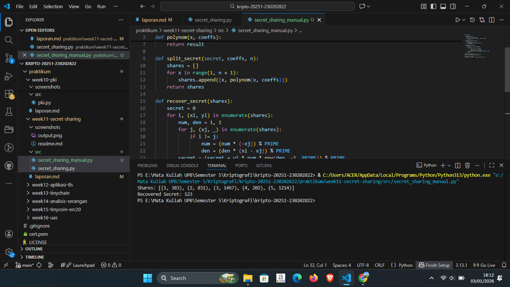

# Laporan Praktikum Kriptografi
Minggu ke-: 11  
Topik: [Secret Sharing (Shamir’s Secret Sharing)]  
Nama: [Surya Subekti]  
NIM: [230202822]  
Kelas: [5IKRA]  

---

## 1. Tujuan
- Menjelaskan konsep Shamir Secret Sharing (SSS).
- Melakukan simulasi pembagian rahasia ke beberapa pihak menggunakan skema SSS.
- Menganalisis keamanan skema distribusi rahasia.


---

## 2. Dasar Teori
Secret sharing merupakan teknik kriptografi yang digunakan untuk membagi suatu informasi rahasia menjadi beberapa bagian (share) yang didistribusikan kepada pihak berbeda. Tujuan utama dari mekanisme ini adalah untuk menghindari ketergantungan pada satu pihak dalam penyimpanan rahasia. Setiap bagian yang dibagikan tidak memiliki makna secara mandiri, sehingga kerahasiaan informasi tetap terjaga meskipun sebagian share jatuh ke pihak yang tidak berwenang.

Salah satu skema secret sharing yang paling dikenal adalah Shamir Secret Sharing, yang diperkenalkan oleh Adi Shamir. Metode ini memanfaatkan konsep polinomial dalam aritmetika modulo bilangan prima. Rahasia direpresentasikan sebagai konstanta dari suatu polinomial, sementara koefisien lainnya dipilih secara acak. Skema ini menerapkan prinsip threshold, yaitu jumlah minimum share yang diperlukan untuk merekonstruksi rahasia. Selama jumlah share yang dikumpulkan kurang dari threshold, rahasia tidak dapat dihitung kembali secara matematis.

Proses rekonstruksi rahasia pada secret sharing dilakukan menggunakan teknik interpolasi, khususnya interpolasi Lagrange. Dengan menggabungkan sejumlah share yang memenuhi nilai threshold, polinomial awal dapat direkonstruksi, sehingga nilai rahasia dapat diperoleh kembali tanpa perlu mengetahui seluruh koefisien polinomial. Pendekatan ini memberikan keseimbangan antara keamanan dan ketersediaan data, sehingga secret sharing banyak digunakan pada sistem keamanan modern, seperti manajemen kunci kriptografi, sistem otorisasi bersama, dan penyimpanan data sensitif terdistribusi.

---

## 3. Alat dan Bahan
(- Python 3.x  
- Visual Studio Code / editor lain  
- Git dan akun GitHub  
- Library tambahan (misalnya pycryptodome, jika diperlukan)  )

---

## 4. Langkah Percobaan
(Tuliskan langkah yang dilakukan sesuai instruksi.  
Contoh format:
1. Membuat file `caesar_cipher.py` di folder `praktikum/week2-cryptosystem/src/`.
2. Menyalin kode program dari panduan praktikum.
3. Menjalankan program dengan perintah `python caesar_cipher.py`.)

---

## 5. Source Code
```python
import random

# bilangan prima besar
PRIME = 208351617316091241234326746312124448251235562226470491514186331217050270460481

# konversi string ke integer
def str_to_int(s):
    return int.from_bytes(s.encode(), 'big')

# konversi integer ke string
def int_to_str(i):
    length = (i.bit_length() + 7) // 8
    return i.to_bytes(length, 'big').decode()

# fungsi polinomial
def polynom(x, coefficients):
    result = 0
    for power, coef in enumerate(coefficients):
        result = (result + coef * pow(x, power, PRIME)) % PRIME
    return result

# split secret
def split_secret(secret, k, n):
    secret_int = str_to_int(secret)
    coeffs = [secret_int] + [random.randrange(0, PRIME) for _ in range(k - 1)]

    shares = []
    for x in range(1, n + 1):
        y = polynom(x, coeffs)
        shares.append((x, y))
    return shares

# lagrange interpolation
def recover_secret(shares):
    secret = 0
    for i, (xi, yi) in enumerate(shares):
        num, den = 1, 1
        for j, (xj, _) in enumerate(shares):
            if i != j:
                num = (num * (-xj)) % PRIME
                den = (den * (xi - xj)) % PRIME
        lagrange = yi * num * pow(den, -1, PRIME)
        secret = (PRIME + secret + lagrange) % PRIME
    return int_to_str(secret)

# ================== TEST ==================
secret = "KriptografiUPB2025"
shares = split_secret(secret, 3, 5)

print("Shares:")
for s in shares:
    print(s)

recovered = recover_secret(shares[:3])
print("\nRecovered secret:", recovered)

```


---

## 6. Hasil dan Pembahasan
Hasil eksekusi program Secret Sharing:




---

## 7. Jawaban Pertanyaan
1. Apa keuntungan utama Shamir Secret Sharing dibanding membagikan salinan kunci secara langsung?
    - Shamir Secret Sharing memiliki keunggulan karena tidak menyimpan kunci secara utuh pada satu pihak atau dalam bentuk salinan penuh. Setiap pihak hanya memegang sebagian informasi yang secara individual tidak bermakna, sehingga kebocoran satu atau beberapa bagian tidak langsung membahayakan kerahasiaan kunci utama.
2. Apa peran threshold (k) dalam keamanan secret sharing?
    - Nilai threshold (k) berfungsi sebagai batas minimum jumlah bagian yang harus digabungkan untuk merekonstruksi secret. Mekanisme ini memastikan bahwa secret tetap aman selama jumlah bagian yang terkumpul kurang dari k, sekaligus memberikan kontrol terhadap tingkat toleransi kegagalan atau kompromi sistem.
3. Berikan satu contoh skenario nyata di mana SSS sangat bermanfaat.
    - Salah satu contoh penerapan SSS adalah pada pengelolaan kunci enkripsi data pusat (data center). Kunci utama dibagi ke beberapa administrator, sehingga hanya jika sejumlah administrator tertentu bekerja sama, kunci tersebut dapat diakses. Pendekatan ini mencegah penyalahgunaan akses oleh satu individu dan meningkatkan keamanan organisasi.

---

## 8. Kesimpulan
Berdasarkan pembahasan yang telah saya lakukan, secret sharing merupakan teknik kriptografi yang efektif untuk menjaga kerahasiaan data dengan membagi secret ke dalam beberapa bagian. Setiap bagian tidak memiliki arti secara mandiri sehingga risiko kebocoran data dapat diminimalkan.

Melalui skema Shamir Secret Sharing, saya memahami bahwa konsep threshold memegang peranan penting, karena rahasia hanya dapat direkonstruksi apabila jumlah share yang digunakan memenuhi batas minimum. Dengan demikian, metode ini mampu meningkatkan keamanan sekaligus menjaga ketersediaan informasi pada sistem terdistribusi.
---

## 9. Daftar Pustaka
(Cantumkan referensi yang digunakan.  
Contoh:  
- Katz, J., & Lindell, Y. *Introduction to Modern Cryptography*.  
- Stallings, W. *Cryptography and Network Security*.  )

---

## 10. Commit Log
```
    week11-secret-sharing

commit 584407bc1f15693f1f350ae1eea3adcba7a1043b
Author: Surya Subekti <115227173+Ayrus27@users.noreply.github.com>
Date:   Sat Jan 3 17:52:03 2026 +0700

```
