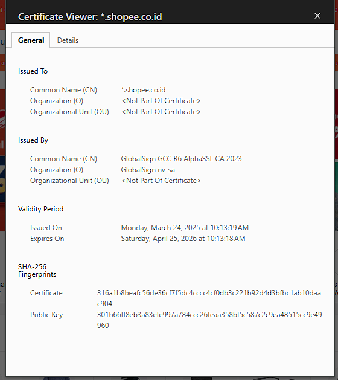
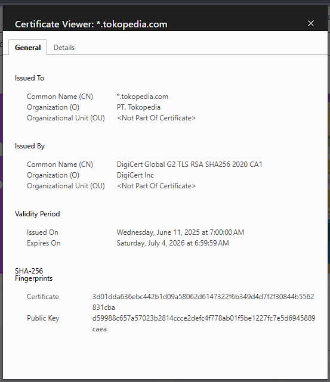
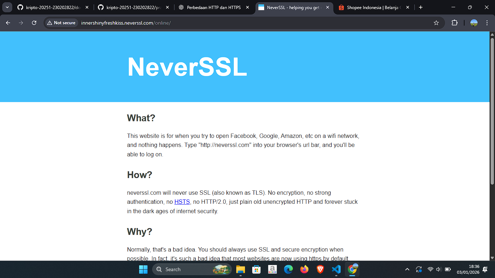

# Laporan Praktikum Kriptografi
Minggu ke-: 12  
Topik: [Aplikasi TLS & E-commerce]  
Nama: [Surya Subekti]  
NIM: [230202822]  
Kelas: [5IKRA]  

---

## 1. Tujuan
- Penggunaan kriptografi pada email dan SSL/TLS.
- Menjelaskan enkripsi dalam transaksi e-commerce.
- Mengevaluasi isu etika & privasi dalam penggunaan kriptografi di kehidupan sehari-hari.

---

## 2. Dasar Teori
Transport Layer Security (TLS) merupakan protokol keamanan yang digunakan untuk melindungi komunikasi data pada jaringan komputer, khususnya di internet. TLS bekerja pada lapisan transport untuk menyediakan mekanisme pengamanan berupa enkripsi data, autentikasi pihak yang berkomunikasi, serta menjaga integritas informasi selama proses transmisi. Protokol ini dikembangkan sebagai penerus Secure Socket Layer (SSL) dan saat ini menjadi standar utama dalam pengamanan layanan digital seperti web (HTTPS), email, dan aplikasi berbasis jaringan lainnya.

Dalam implementasinya, TLS menggunakan kombinasi kriptografi kunci simetris dan kunci asimetris. Pada tahap awal komunikasi, TLS melakukan proses handshake yang melibatkan pertukaran sertifikat digital dan kunci publik untuk memverifikasi identitas server (dan klien jika diperlukan). Setelah proses autentikasi berhasil, kedua pihak akan menghasilkan session key yang digunakan untuk enkripsi simetris selama sesi komunikasi berlangsung. Pendekatan ini dipilih karena enkripsi simetris lebih efisien untuk pertukaran data dalam jumlah besar.

Penerapan TLS memberikan manfaat utama dalam menjaga kerahasiaan dan keamanan data pengguna, namun juga menghadirkan tantangan tertentu. Pengelolaan sertifikat digital, ketergantungan pada Certificate Authority (CA), serta kerentanan akibat konfigurasi yang tidak tepat dapat memengaruhi tingkat keamanan sistem. Meskipun demikian, TLS tetap menjadi fondasi penting dalam komunikasi digital modern karena mampu meningkatkan kepercayaan, melindungi privasi, dan mengurangi risiko serangan siber seperti penyadapan dan pemalsuan data.

---

## 3. Alat dan Bahan
(- Python 3.x  
- Visual Studio Code / editor lain  
- Git dan akun GitHub  
- Library tambahan (misalnya pycryptodome, jika diperlukan)  )

---

## 4. Langkah Percobaan
(Tuliskan langkah yang dilakukan sesuai instruksi.  
Contoh format:
1. Membuat file `caesar_cipher.py` di folder `praktikum/week2-cryptosystem/src/`.
2. Menyalin kode program dari panduan praktikum.
3. Menjalankan program dengan perintah `python caesar_cipher.py`.)

---

## 5. Source Code
```python
# contoh potongan kode
def encrypt(text, key):
    return ...
```


---

## 6. Hasil dan Pembahasan
1. Analisis Sertifikat Digital Website Tokopedia
    - Berdasarkan hasil pemeriksaan sertifikat digital pada website Tokopedia, diketahui bahwa website tersebut menggunakan sertifikat Wildcard dengan Common Name (CN) *.tokopedia.com, yang memungkinkan perlindungan untuk seluruh subdomain. Sertifikat ini diterbitkan oleh DigiCert Global G2 TLS RSA SHA256 2020 CA1, salah satu Certificate Authority (CA) global yang terpercaya. Masa berlaku sertifikat dimulai pada 11 Juni 2025 dan berakhir pada 4 Juli 2026, menunjukkan bahwa sertifikat masih aktif dan valid.
    Dari sisi kriptografi, sertifikat Tokopedia menggunakan algoritma RSA dengan hash SHA-256, yang merupakan standar keamanan modern untuk komunikasi TLS. Penggunaan algoritma ini memastikan proses autentikasi server berjalan aman dan data yang ditransmisikan tidak mudah dipalsukan atau dimodifikasi oleh pihak ketiga.
2. Analisis Sertifikat Digital Website Shopee
    - Hasil pemeriksaan pada website Shopee Indonesia menunjukkan bahwa situs ini juga menggunakan sertifikat Wildcard dengan Common Name (CN) *.shopee.co.id. Sertifikat tersebut diterbitkan oleh GlobalSign GCC R6 AlphaSSL CA 2023, yang merupakan CA internasional dengan reputasi baik dalam penyediaan sertifikat SSL/TLS. Sertifikat Shopee berlaku sejak 24 Maret 2025 hingga 25 April 2026.
    Penggunaan sertifikat SSL/TLS ini memungkinkan Shopee untuk menyediakan koneksi aman bagi pengguna, khususnya pada proses login, pengisian data pribadi, dan transaksi pembayaran. Sertifikat yang masih valid memastikan bahwa komunikasi antara browser pengguna dan server Shopee telah terenkripsi serta terautentikasi dengan baik.
3. Perbandingan Website HTTPS dan HTTP (NeverSSL)
    - Berdasarkan pengamatan pada website NeverSSL, terlihat bahwa situs tersebut tidak menggunakan protokol HTTPS, melainkan hanya HTTP. Hal ini ditandai dengan munculnya peringatan “Not Secure” pada address bar browser. Website tanpa TLS tidak menyediakan mekanisme enkripsi, sehingga data yang dikirimkan dalam jaringan berada dalam bentuk plaintext dan dapat dengan mudah disadap oleh pihak tidak berwenang.
    Sebaliknya, website e-commerce seperti Tokopedia dan Shopee yang menggunakan HTTPS mampu menjamin kerahasiaan, integritas, dan autentikasi data. Perbedaan ini menunjukkan bahwa penggunaan TLS sangat krusial dalam layanan digital modern, terutama yang melibatkan data sensitif dan transaksi keuangan. Tanpa TLS, risiko serangan seperti Man-in-the-Middle, pencurian kredensial, dan manipulasi data menjadi sangat tinggi.

Hasil eksekusi program Aplikasi TLS:





---

## 7. Jawaban Pertanyaan
1. Apa perbedaan utama antara HTTP dan HTTPS?
    - HTTP (Hypertext Transfer Protocol) merupakan protokol komunikasi web yang mengirimkan data dalam bentuk teks biasa (plaintext) sehingga rentan terhadap penyadapan dan manipulasi oleh pihak tidak berwenang. Sebaliknya, HTTPS (Hypertext Transfer Protocol Secure) adalah versi aman dari HTTP yang menggunakan TLS/SSL untuk mengenkripsi data selama proses transmisi. Dengan HTTPS, kerahasiaan, integritas, dan keaslian data lebih terjamin, sehingga pengguna terlindungi dari serangan seperti man-in-the-middle.
2. Mengapa sertifikat digital menjadi penting dalam komunikasi TLS?
    - Sertifikat digital berfungsi untuk memverifikasi identitas pihak yang berkomunikasi (misalnya server web) dalam protokol TLS. Sertifikat ini diterbitkan oleh Certificate Authority (CA) yang terpercaya dan berisi informasi identitas serta kunci publik pemilik sertifikat. Dengan adanya sertifikat digital, klien dapat memastikan bahwa koneksi yang terjalin benar-benar menuju server yang sah, sehingga mencegah pemalsuan identitas dan meningkatkan kepercayaan dalam komunikasi aman.
3. Bagaimana kriptografi mendukung privasi dalam komunikasi digital, tetapi sekaligus menimbulkan tantangan hukum dan etika?
    - Kriptografi mendukung privasi dalam komunikasi digital dengan cara melindungi kerahasiaan data, menjamin integritas informasi, serta memastikan autentikasi pihak yang berkomunikasi. Namun, di sisi lain, penggunaan kriptografi—terutama enkripsi kuat dan end-to-end encryption—menimbulkan tantangan hukum dan etika. Aparat penegak hukum dapat mengalami kesulitan dalam proses penyelidikan karena data tidak dapat diakses, sementara secara etis muncul dilema antara hak atas privasi individu dan kepentingan keamanan publik. Oleh karena itu, diperlukan regulasi dan kebijakan yang seimbang agar perlindungan privasi tetap terjaga tanpa menghambat penegakan hukum.
---

## 8. Kesimpulan
(Tuliskan kesimpulan singkat (2–3 kalimat) berdasarkan percobaan.  )

---

## 9. Daftar Pustaka
(Cantumkan referensi yang digunakan.  
Contoh:  
- Katz, J., & Lindell, Y. *Introduction to Modern Cryptography*.  
- Stallings, W. *Cryptography and Network Security*.  )

---

## 10. Commit Log
```
    week12-aplikasi-tls

commit 4667d8ab1158fd88e53fc60826f06538c17a2b63
Author: Surya Subekti <115227173+Ayrus27@users.noreply.github.com>
Date:   Sat Jan 3 18:17:44 2026 +0700

```
