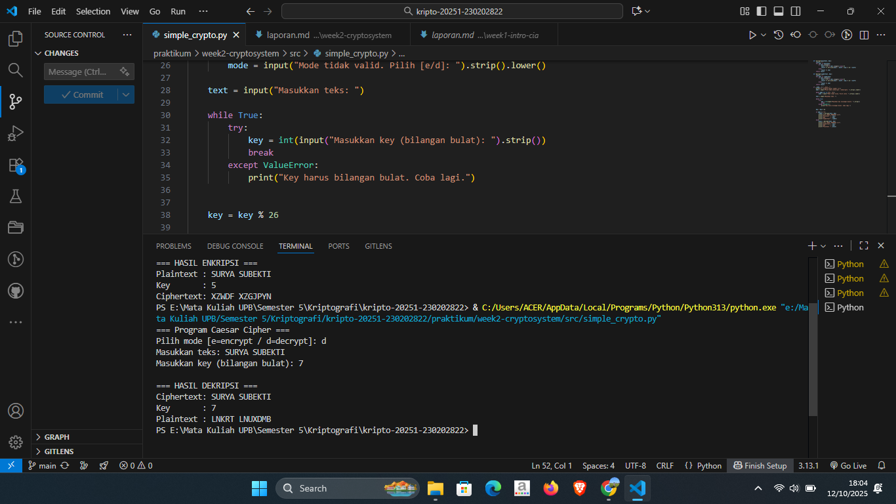

# Laporan Praktikum Kriptografi
Minggu ke-: 2  
Topik: [Cryptosystem]  
Nama: [Surya Subekti]  
NIM: [230202822]  
Kelas: [5IKRA]  

---

## 1. Tujuan

1. Mengidentifikasi komponen dasar kriptosistem (plaintext, ciphertext, kunci, algoritma).  
2. Menggambarkan proses enkripsi dan dekripsi sederhana.  
3. Mengklasifikasikan jenis kriptosistem (simetris dan asimetris). 

---

## 2. Dasar Teori
Cryptosystem atau sistem kriptografi adalah seperangkat metode yang digunakan untuk mengamankan pesan atau data agar hanya pihak tertentu yang dapat membacanya. Sistem ini memastikan kerahasiaan, keaslian, integritas, dan keabsahan informasi dalam proses komunikasi digital. Dengan demikian, cryptosystem berperan penting dalam menjaga keamanan data pada jaringan modern.

Dalam sebuah cryptosystem, terdapat beberapa komponen utama yaitu plaintext (pesan asli), ciphertext (pesan terenkripsi), algoritma enkripsi dan dekripsi, serta kunci (key) yang digunakan untuk mengubah dan mengembalikan pesan. Proses enkripsi mengubah plaintext menjadi ciphertext, sedangkan dekripsi mengembalikan ciphertext ke bentuk aslinya menggunakan kunci yang sesuai.

Terdapat dua jenis utama cryptosystem, yaitu kriptografi simetris dan kriptografi asimetris. Kriptografi simetris menggunakan satu kunci yang sama untuk enkripsi dan dekripsi, contohnya Caesar Cipher dan AES. Sedangkan kriptografi asimetris menggunakan dua kunci berbeda, yaitu kunci publik dan kunci privat, seperti pada algoritma RSA. Kedua jenis ini banyak digunakan dalam aplikasi keamanan seperti HTTPS, email terenkripsi, dan tanda tangan digital.

---

## 3. Alat dan Bahan
(- Python 3.x  
- Visual Studio Code / editor lain  
- Git dan akun GitHub  
- Library tambahan (misalnya pycryptodome, jika diperlukan)  )

---

## 4. Langkah Percobaan
(Tuliskan langkah yang dilakukan sesuai instruksi.  
Contoh format:
1. Membuat file `caesar_cipher.py` di folder `praktikum/week2-cryptosystem/src/`.
2. Menyalin kode program dari panduan praktikum.
3. Menjalankan program dengan perintah `python caesar_cipher.py`.)

---

## 5. Source Code


---

## 6. Hasil dan Pembahasan

Hasil Eksekusi Program Caesar Cipher:




---

## 7. Jawaban Pertanyaan
Jawab pertanyaan diskusi yang diberikan pada modul.  
1. Sebutkan komponen utama dalam sebuah kriptosistem. 
    - Sebuah kriptosistem (sistem kriptografi) terdiri dari lima komponen utama:
        - Plaintext (Teks Asli):
            Data atau pesan asli yang akan diamankan sebelum dikirim.
        - Algoritma Enkripsi:
            Prosedur matematis yang digunakan untuk mengubah plaintext menjadi ciphertext (teks terenkripsi).
        - Ciphertext (Teks Terenkripsi):
            Hasil dari proses enkripsi; data yang tidak dapat dibaca tanpa dekripsi.
        - Algoritma:
            Prosedur matematis yang digunakan untuk mengembalikan ciphertext menjadi plaintext.
        - Kunci (Key):
            Parameter rahasia yang digunakan dalam proses enkripsi dan/atau dekripsi. Keamanan sistem sangat bergantung pada kerahasiaan dan kekuatan kunci.
2. Apa kelebihan dan kelemahan sistem simetris dibandingkan asimetris?
    - Simetris
        - Kelebihan:
            - Lebih cepat dan efisien secara komputasi.
            - Cocok untuk enkripsi data dalam jumlah besar (misalnya file, komunikasi real-time).
        - Kekurangan:
            - Masalah distribusi kunci: kedua pihak harus memiliki kunci yang sama dan menjaganya tetap rahasia.
            - Tidak mendukung tanda tangan digital secara alami.
    - Asimetris
        - Kelebihan:
            - Tidak memerlukan pertukaran kunci rahasia secara aman sebelum komunikasi.
            - Mendukung fitur seperti tanda tangan digital dan autentikasi.
        - Kekurangan:
            - Jauh lebih lambat dan membutuhkan sumber daya komputasi lebih besar.
            - Tidak efisien untuk enkripsi data besar secara langsung.
3. Mengapa distribusi kunci menjadi masalah utama dalam kriptografi simetris?
    - Karena pada kriptografi simetris proses enkripsi dan dekripsi menggunakan kunci yang sama, maka pengirim dan penerima pesan harus memiliki kunci identik agar komunikasi dapat berlangsung. Masalah muncul pada tahap distribusi kunci, yaitu bagaimana cara mengirimkan kunci rahasia tersebut kepada pihak penerima tanpa diketahui oleh pihak lain. Jika kunci berhasil disadap atau dicuri selama proses distribusi, maka seluruh sistem keamanan akan terganggu karena pihak ketiga dapat membaca pesan yang terenkripsi. Oleh sebab itu, distribusi kunci menjadi masalah utama dalam kriptografi simetris dan sering diatasi dengan memanfaatkan kriptografi asimetris untuk menukar kunci secara aman.

---

## 8. Kesimpulan

Dari praktikum ini dapat disimpulkan bahwa:
1. Kriptosistem terdiri dari komponen penting yaitu plaintext, ciphertext, algoritma, dan kunci.
2. Proses enkripsi mengubah pesan asli menjadi bentuk yang tidak terbaca (ciphertext), sedangkan dekripsi mengembalikannya ke bentuk semula.
3. Caesar Cipher merupakan contoh sederhana dari kriptografi simetris yang mudah dipahami namun tidak aman untuk penggunaan modern karena kunci dapat ditebak dengan mudah.
4. Pemahaman dasar kriptosistem penting sebagai dasar untuk memahami algoritma yang lebih kompleks seperti AES dan RSA.

---

## 9. Daftar Pustaka
(Cantumkan referensi yang digunakan.  
Contoh:  
- Katz, J., & Lindell, Y. *Introduction to Modern Cryptography*.  
- Stallings, W. *Cryptography and Network Security*.  )

---

## 10. Commit Log

```
commit week-cryptosystem
Author: Surya Subekti <suryasubekti28@gmail.com>
Date:   2025-10-10

    week2-cryptosystem: implementasi Caesar Cipher dan laporan 
```
