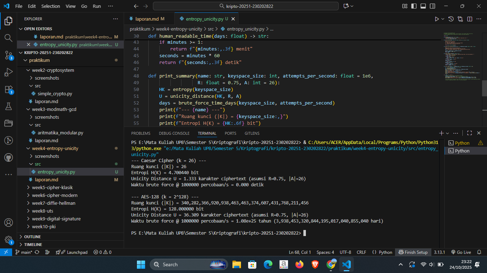

# Laporan Praktikum Kriptografi
Minggu ke-: 4  
Topik: [Entropy & Unicity Distance]  
Nama: [Surya Subekti]  
NIM: [230202822]  
Kelas: [5IKRA]  

---

## 1. Tujuan
1. Menyelesaikan perhitungan sederhana terkait entropi kunci.
2. Menggunakan teorema Euler pada contoh perhitungan modular & invers.
3. Menghitung unicity distance untuk ciphertext tertentu.
4. Menganalisis kekuatan kunci berdasarkan entropi dan unicity distance.
5. Mengevaluasi potensi serangan brute force pada kriptosistem sederhana.

---

## 2. Dasar Teori
Entropy dalam kriptografi merupakan ukuran tingkat ketidakpastian atau keacakan dalam suatu sistem kunci. Semakin tinggi nilai entropi, semakin sulit bagi penyerang untuk menebak atau memprediksi kunci yang digunakan. Entropi dihitung dalam satuan bit dan mencerminkan banyaknya kemungkinan kombinasi kunci yang mungkin terbentuk. Misalnya, sebuah kunci 128-bit memiliki entropi maksimum sebesar 128 bit, yang berarti ada $2^{128}$ kemungkinan kombinasi. Konsep ini penting karena tingkat entropi menentukan sejauh mana sistem kriptografi tahan terhadap serangan brute force — serangan yang mencoba semua kombinasi kunci secara sistematis hingga menemukan yang benar.

Unicity Distance adalah konsep yang digunakan untuk mengukur seberapa banyak ciphertext yang dibutuhkan agar kunci yang digunakan dalam proses enkripsi dapat ditentukan secara unik. Istilah ini pertama kali diperkenalkan oleh Claude Shannon dalam teori informasi. Nilai Unicity Distance bergantung pada panjang kunci, ukuran alfabet pesan, dan redundansi bahasa dari plaintext. Semakin besar nilai Unicity Distance, semakin banyak data yang diperlukan bagi penyerang untuk memecahkan kunci dengan pasti. Dengan demikian, sistem dengan Unicity Distance yang tinggi dianggap lebih aman karena tidak mudah dipecahkan hanya dengan sejumlah kecil ciphertext.

Evaluasi kekuatan kunci terhadap serangan brute force dapat dilakukan dengan menganalisis hubungan antara entropi dan Unicity Distance. Kunci dengan entropi tinggi dan Unicity Distance besar akan memiliki tingkat keamanan yang lebih baik karena memperkecil peluang keberhasilan brute force dalam waktu yang wajar. Dalam praktiknya, kekuatan kriptografi juga dipengaruhi oleh kemampuan komputasi modern; meskipun secara teoretis kunci 64-bit dapat dipecahkan dengan brute force, dalam kenyataan waktu dan sumber daya yang dibutuhkan bisa sangat besar. Oleh karena itu, pemilihan panjang kunci yang sesuai dan pengelolaan entropi yang baik menjadi faktor utama dalam memastikan keamanan sistem kriptografi modern.
---

## 3. Alat dan Bahan
(- Python 3.x  
- Visual Studio Code / editor lain  
- Git dan akun GitHub  
- Library tambahan (misalnya pycryptodome, jika diperlukan)  )

---

## 4. Langkah Percobaan
(Tuliskan langkah yang dilakukan sesuai instruksi.  
Contoh format:
1. Membuat file `caesar_cipher.py` di folder `praktikum/week2-cryptosystem/src/`.
2. Menyalin kode program dari panduan praktikum.
3. Menjalankan program dengan perintah `python caesar_cipher.py`.)

---

## 5. Source Code
```python
# entropy_unicity.py
# Tujuan: Mengevaluasi kekuatan kunci berdasarkan teori kriptografi

import math

# Langkah 1 — Perhitungan Entropi
def entropy(keyspace_size):
    # Rumus: H(K) = log2(|K|)
    return math.log2(keyspace_size)

# Langkah 2 — Menghitung Unicity Distance
def unicity_distance(HK, R=0.75, A=26):
    # Rumus: U = H(K) / (R * log2(|A|))
    # R = redundansi bahasa (misal: 0.75 untuk bahasa Inggris)
    # A = ukuran alfabet (default 26 untuk huruf A–Z)
    return HK / (R * math.log2(A))

# Langkah 3 — Analisis Brute Force
def brute_force_time_days(keyspace_size, attempts_per_second=1e6):
    # Menghitung waktu brute force dalam satuan hari
    seconds = keyspace_size / attempts_per_second
    days = seconds / (3600 * 24)
    return days

def human_readable_time(days):
    # Mengubah satuan waktu agar mudah dibaca (hari → tahun / jam / menit)
    if days >= 365:
        years = days / 365
        return f"{years:,.3g} tahun ({days:,.0f} hari)"
    elif days >= 1:
        return f"{days:,.3f} hari"
    elif days * 24 >= 1:
        return f"{days * 24:,.3f} jam"
    else:
        return f"{days * 24 * 60:,.3f} menit"

# Langkah 4 — Menampilkan Hasil Analisis
def print_summary(name, keyspace_size, attempts_per_second=1e6, R=0.75, A=26):
    HK = entropy(keyspace_size)
    U = unicity_distance(HK, R, A)
    days = brute_force_time_days(keyspace_size, attempts_per_second)
    
    print(f"# Analisis: {name}")
    print(f"Ruang kunci (|K|) = {keyspace_size:,}")
    print(f"Entropi H(K) = {HK:.6f} bit")
    print(f"Unicity Distance U = {U:.3f} karakter ciphertext (asumsi R={R}, |A|={A})")
    print(f"Waktu brute force @ {attempts_per_second:.0f} percobaan/s = {human_readable_time(days)}")
    print()

# Langkah 5 — Eksekusi Program
if __name__ == "__main__":
    # Contoh analisis untuk Caesar Cipher dan AES-128
    print_summary("Caesar Cipher (k = 26)", 26)
    print_summary("AES-128 (k = 2^128)", 2**128)
```


---

## 6. Hasil dan Pembahasan
(- Lampirkan screenshot hasil eksekusi program (taruh di folder `screenshots/`).  
- Berikan tabel atau ringkasan hasil uji jika diperlukan.  
- Jelaskan apakah hasil sesuai ekspektasi.  
- Bahas error (jika ada) dan solusinya. 

Hasil eksekusi program Caesar Cipher:



)

---

## 7. Jawaban Pertanyaan 
1. Apa arti dari nilai entropy dalam konteks kekuatan kunci?
    - Nilai entropy dalam konteks kekuatan kunci menunjukkan tingkat keacakan atau ketidakpastian dari suatu sistem kunci. Semakin tinggi nilai entropy, semakin sulit bagi penyerang untuk menebak kunci yang benar karena jumlah kemungkinan kombinasi kunci menjadi sangat besar. Dengan demikian, entropy berfungsi sebagai ukuran matematis untuk menentukan seberapa kuat dan sulitnya suatu kunci untuk diretas.
2. Mengapa unicity distance penting dalam menentukan keamanan suatu cipher?
    - Karena unicity distance menunjukkan seberapa banyak ciphertext yang dibutuhkan untuk secara unik menentukan kunci enkripsi yang digunakan. Jika nilai unicity distance tinggi, maka diperlukan lebih banyak data terenkripsi untuk menemukan kunci yang benar, sehingga cipher menjadi lebih sulit dipecahkan dan memiliki tingkat keamanan yang lebih baik.
3. Mengapa brute force masih menjadi ancaman meskipun algoritma sudah kuat?
    - Karena brute force tidak bergantung pada kelemahan algoritma, melainkan pada percobaan semua kemungkinan kunci hingga menemukan yang benar. Walaupun algoritma kriptografi modern sangat kuat, kemajuan daya komputasi dan penggunaan teknologi seperti komputasi paralel atau komputer kuantum dapat mempercepat proses brute force, sehingga tetap menjadi ancaman potensial terhadap keamanan sistem.

---

## 8. Kesimpulan
Berdasarkan hasil analisis yang dilakukan menggunakan perhitungan entropy, unicity distance, dan simulasi brute force, dapat disimpulkan bahwa kekuatan suatu sistem kriptografi sangat bergantung pada tingkat keacakan dan ukuran ruang kuncinya. Nilai entropy yang tinggi menunjukkan bahwa kunci memiliki tingkat ketidakpastian yang besar, sehingga semakin sulit untuk ditebak atau dipecahkan oleh penyerang.

Selanjutnya, unicity distance memberikan gambaran tentang seberapa banyak ciphertext yang dibutuhkan agar kunci dapat ditentukan secara unik. Semakin besar nilai unicity distance, maka semakin tinggi pula tingkat keamanan suatu cipher karena diperlukan lebih banyak data untuk menemukan kunci yang benar.

Meskipun algoritma kriptografi modern seperti AES memiliki entropi dan unicity distance yang tinggi, serangan brute force tetap menjadi ancaman potensial apabila daya komputasi meningkat di masa depan. Oleh karena itu, pemilihan panjang kunci yang tepat dan manajemen entropi yang baik menjadi faktor utama dalam menjaga keamanan sistem enkripsi secara berkelanjutan.
---

## 9. Daftar Pustaka
(Cantumkan referensi yang digunakan.  
Contoh:  
- Katz, J., & Lindell, Y. *Introduction to Modern Cryptography*.  
- Stallings, W. *Cryptography and Network Security*.  )

---

## 10. Commit Log
```
    week4_entropy-unicity

commit 34c8bb18d3f87238336c46d27a09de1ef755d886
Author: Surya Subekti <suryasubekti28@gmmail.com>
Date:   Fri Oct 24 23:23:39 2025 +0700

    week4-entropy-unicity: implementasi entropy & unicity dan laporan )
```
