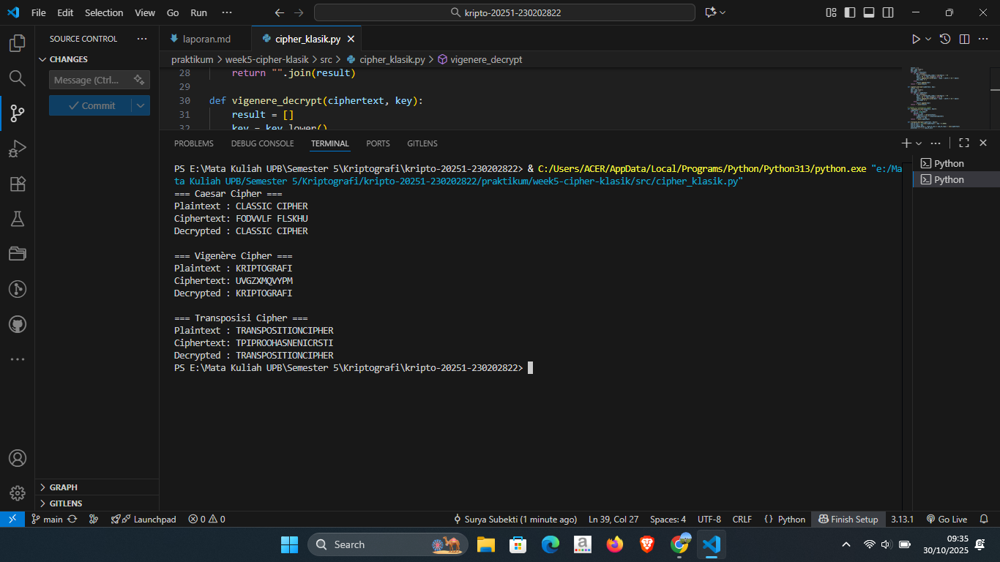

# Laporan Praktikum Kriptografi
Minggu ke-: 5  
Topik: [Cipher Klasik]  
Nama: [Surya Subekti]  
NIM: [230202822]  
Kelas: [5IKRA]  

---

## 1. Tujuan
1. Menerapkan algoritma Caesar Cipher untuk enkripsi dan dekripsi teks.
2. Menerapkan algoritma Vigenère Cipher dengan variasi kunci.
3. Mengimplementasikan algoritma transposisi sederhana.
4. Menjelaskan kelemahan algoritma kriptografi klasik.

---

## 2. Dasar Teori
Cipher klasik merupakan salah satu bentuk awal dari teknik kriptografi yang digunakan untuk menjaga kerahasiaan pesan sebelum munculnya sistem kriptografi modern berbasis komputer. Cipher jenis ini bekerja dengan cara mengubah bentuk huruf atau susunan karakter dalam pesan asli (plaintext) menjadi bentuk yang tidak dapat dibaca (ciphertext) menggunakan aturan atau kunci tertentu. Tujuan utama dari cipher klasik adalah menyamarkan makna pesan agar tidak dapat dipahami oleh pihak yang tidak berhak, meskipun metode yang digunakan masih bersifat sederhana dan mudah diuraikan dengan teknik analisis frekuensi.

Salah satu jenis cipher klasik yang paling terkenal adalah Caesar Cipher, yang dikembangkan oleh Julius Caesar untuk keperluan komunikasi militer. Metode ini menggunakan teknik substitusi huruf berdasarkan pergeseran alfabet sejauh n posisi. Misalnya, dengan pergeseran tiga huruf, huruf “A” akan berubah menjadi “D”, “B” menjadi “E”, dan seterusnya. Meski sederhana, cipher ini memberikan dasar pemahaman penting tentang prinsip enkripsi dan dekripsi dalam kriptografi. Namun, kelemahannya terletak pada ruang kunci yang kecil, sehingga mudah dipecahkan dengan brute-force atau analisis frekuensi.

Selain Caesar Cipher, terdapat Vigenère Cipher yang merupakan pengembangan dari konsep substitusi dengan penggunaan kata kunci (key) sebagai dasar pergeseran huruf. Metode ini menggunakan tabel Vigenère square atau tabula recta yang memadukan beberapa Caesar Cipher dengan pergeseran berbeda, sehingga menghasilkan enkripsi yang lebih kompleks. Sementara itu, Cipher Transposisi bekerja dengan cara mengubah urutan huruf dalam pesan tanpa menggantinya, misalnya dengan menulis pesan dalam bentuk tabel dan membaca kolom tertentu untuk membentuk ciphertext. Kombinasi antara cipher substitusi seperti Caesar dan Vigenère dengan cipher transposisi dapat meningkatkan keamanan pesan dalam sistem kriptografi klasik.

---

## 3. Alat dan Bahan
(- Python 3.x  
- Visual Studio Code / editor lain  
- Git dan akun GitHub  
- Library tambahan (misalnya pycryptodome, jika diperlukan)  )

---

## 4. Langkah Percobaan
(Tuliskan langkah yang dilakukan sesuai instruksi.  
Contoh format:
1. Membuat file `caesar_cipher.py` di folder `praktikum/week2-cryptosystem/src/`.
2. Menyalin kode program dari panduan praktikum.
3. Menjalankan program dengan perintah `python caesar_cipher.py`.)

---

## 5. Source Code
```python
# Langkah 1 — Caesar Cipher
def caesar_encrypt(plaintext, key):
    result = ""
    for char in plaintext:
        if char.isalpha():
            shift = 65 if char.isupper() else 97
            result += chr((ord(char) - shift + key) % 26 + shift)
        else:
            result += char
    return result

def caesar_decrypt(ciphertext, key):
    return caesar_encrypt(ciphertext, -key)

# Langkah 2 — Vigenère Cipher
def vigenere_encrypt(plaintext, key):
    result = []
    key = key.lower()
    key_index = 0
    for char in plaintext:
        if char.isalpha():
            shift = ord(key[key_index % len(key)]) - 97
            base = 65 if char.isupper() else 97
            result.append(chr((ord(char) - base + shift) % 26 + base))
            key_index += 1
        else:
            result.append(char)
    return "".join(result)

def vigenere_decrypt(ciphertext, key):
    result = []
    key = key.lower()
    key_index = 0
    for char in ciphertext:
        if char.isalpha():
            shift = ord(key[key_index % len(key)]) - 97
            base = 65 if char.isupper() else 97
            result.append(chr((ord(char) - base - shift) % 26 + base))
            key_index += 1
        else:
            result.append(char)
    return "".join(result)

# Langkah 3 — Transposisi Cipher
def transpose_encrypt(plaintext, key=5):
    ciphertext = [''] * key
    for col in range(key):
        pointer = col
        while pointer < len(plaintext):
            ciphertext[col] += plaintext[pointer]
            pointer += key
    return ''.join(ciphertext)

def transpose_decrypt(ciphertext, key=5):
    num_of_cols = int(len(ciphertext) / key + 0.9999)
    num_of_rows = key
    num_of_shaded_boxes = (num_of_cols * num_of_rows) - len(ciphertext)
    plaintext = [''] * num_of_cols
    col = 0
    row = 0
    for symbol in ciphertext:
        plaintext[col] += symbol
        col += 1
        if (col == num_of_cols) or (col == num_of_cols - 1 and row >= num_of_rows - num_of_shaded_boxes):
            col = 0
            row += 1
    return ''.join(plaintext)

# Bagian Uji — Menjalankan Ketiga Cipher
if __name__ == "__main__":
    print("=== Caesar Cipher ===")
    msg = "CLASSIC CIPHER"
    key = 3
    enc = caesar_encrypt(msg, key)
    dec = caesar_decrypt(enc, key)
    print("Plaintext :", msg)
    print("Ciphertext:", enc)
    print("Decrypted :", dec)
    print()

    print("=== Vigenère Cipher ===")
    msg = "KRIPTOGRAFI"
    key = "KEY"
    enc = vigenere_encrypt(msg, key)
    dec = vigenere_decrypt(enc, key)
    print("Plaintext :", msg)
    print("Ciphertext:", enc)
    print("Decrypted :", dec)
    print()

    print("=== Transposisi Cipher ===")
    msg = "TRANSPOSITIONCIPHER"
    key = 5
    enc = transpose_encrypt(msg, key)
    dec = transpose_decrypt(enc, key)
    print("Plaintext :", msg)
    print("Ciphertext:", enc)
    print("Decrypted :", dec)

```


---

## 6. Hasil dan Pembahasan
Hasil eksekusi program Caesar Cipher:




---

## 7. Jawaban Pertanyaan

1. Apa kelemahan utama algoritma Caesar Cipher dan Vigenère Cipher?
    - Caesar Cipher memiliki kelemahan utama karena ruang kuncinya sangat kecil, hanya 25 kemungkinan pergeseran. Hal ini membuatnya mudah dipecahkan dengan cara mencoba semua kunci (brute-force). Selain itu, pola kemunculan huruf dalam ciphertext masih menyerupai plaintext, sehingga mudah dianalisis secara statistik.
    Sementara itu, Vigenère Cipher memang lebih kuat karena menggunakan kata kunci untuk menentukan pergeseran huruf, namun tetap rentan jika kuncinya pendek atau berulang. Dengan teknik seperti Kasiski examination atau Friedman test, panjang kunci dapat ditebak dan pesan akhirnya bisa diuraikan.
2. Mengapa cipher klasik mudah diserang dengan analisis frekuensi?
    - Karena Cipher klasik mudah diserang karena tidak menghilangkan pola distribusi huruf dari bahasa aslinya. Setiap bahasa memiliki karakteristik frekuensi huruf tertentu—misalnya huruf “E” paling sering muncul dalam bahasa Inggris. Pola ini tetap terlihat pada ciphertext hasil enkripsi klasik, sehingga penyerang dapat mencocokkan frekuensi huruf dan menebak huruf aslinya. Dengan metode ini, pesan dapat dipecahkan tanpa mengetahui kunci secara langsung.
3. Bandingkan kelebihan dan kelemahan cipher substitusi vs transposisi.
    - Cipher substitusi bekerja dengan mengganti setiap huruf pada plaintext dengan huruf lain, seperti pada Caesar atau Vigenère Cipher. Keunggulannya adalah proses enkripsi dan dekripsi yang sederhana, namun kelemahannya terletak pada pola huruf yang masih dapat dianalisis.
    Sebaliknya, cipher transposisi tidak mengganti huruf, tetapi mengubah urutan huruf dalam pesan. Hal ini membuat distribusi huruf tetap sama namun urutan katanya berubah, sehingga sedikit lebih sulit dianalisis. Akan tetapi, jika digunakan sendirian, transposisi juga mudah dipecahkan dengan mencoba berbagai pola penataan ulang. Kombinasi antara substitusi dan transposisi akan menghasilkan sistem enkripsi klasik yang jauh lebih kuat.

---

## 8. Kesimpulan
(Tuliskan kesimpulan singkat (2–3 kalimat) berdasarkan percobaan.  )

---

## 9. Daftar Pustaka
(Cantumkan referensi yang digunakan.  
Contoh:  
- Katz, J., & Lindell, Y. *Introduction to Modern Cryptography*.  
- Stallings, W. *Cryptography and Network Security*.  )

---

## 10. Commit Log
(Tuliskan bukti commit Git yang relevan.  
Contoh:
```
commit abc12345
Author: Nama Mahasiswa <email>
Date:   2025-09-20

    week2-cryptosystem: implementasi Caesar Cipher dan laporan )
```
