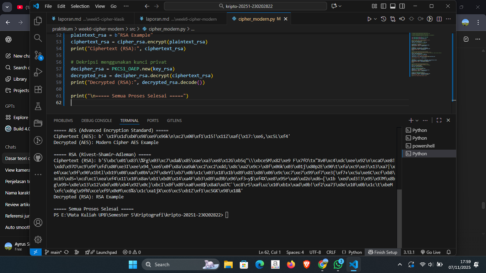

# Laporan Praktikum Kriptografi
Minggu ke-: 6  
Topik: [Cipher Modern]  
Nama: [Surya Subekti]  
NIM: [230202822]  
Kelas: [5IKRA]  

---

## 1. Tujuan
1. Mengimplementasikan algoritma DES untuk blok data sederhana.
2. Menerapkan algoritma AES dengan panjang kunci 128 bit.
3. Menjelaskan proses pembangkitan kunci publik dan privat pada algoritma RSA.

---

## 2. Dasar Teori
Cipher modern merupakan bentuk pengamanan data yang digunakan dalam kriptografi untuk menjaga kerahasiaan, integritas, dan keaslian informasi di era digital. Berbeda dengan cipher klasik yang hanya mengandalkan teknik substitusi dan transposisi sederhana, cipher modern memanfaatkan prinsip matematika kompleks, teori bilangan, serta algoritma komputasi untuk mengamankan pesan. Cipher modern menjadi fondasi utama dalam berbagai protokol keamanan digital seperti SSL/TLS, enkripsi data pada perangkat, serta komunikasi jaringan yang aman.

Secara umum, cipher modern dibagi menjadi dua kategori utama, yaitu cipher simetris dan cipher asimetris. Cipher simetris menggunakan satu kunci yang sama untuk proses enkripsi dan dekripsi, contohnya Advanced Encryption Standard (AES) dan Data Encryption Standard (DES). Sedangkan cipher asimetris menggunakan dua kunci berbeda, yaitu kunci publik dan kunci privat, sebagaimana diterapkan dalam algoritma RSA dan Elliptic Curve Cryptography (ECC). Penggunaan cipher asimetris banyak diterapkan pada sistem autentikasi, tanda tangan digital, dan pertukaran kunci secara aman.

Keunggulan cipher modern terletak pada kekuatan matematis dan efisiensi komputasinya yang mampu menahan berbagai bentuk serangan kriptanalisis. Selain itu, cipher modern dirancang untuk mengatasi kelemahan cipher klasik, seperti mudahnya pola enkripsi ditebak atau dipecahkan dengan analisis frekuensi. Dengan perkembangan teknologi dan peningkatan daya komputasi, penelitian terhadap cipher modern terus berkembang untuk menciptakan algoritma yang lebih cepat, efisien, dan tahan terhadap ancaman serangan baru di dunia siber.

---

## 3. Alat dan Bahan
(- Python 3.x  
- Visual Studio Code / editor lain  
- Git dan akun GitHub  
- Library tambahan (misalnya pycryptodome, jika diperlukan)  )

---

## 4. Langkah Percobaan
(Tuliskan langkah yang dilakukan sesuai instruksi.  
Contoh format:
1. Membuat file `caesar_cipher.py` di folder `praktikum/week2-cryptosystem/src/`.
2. Menyalin kode program dari panduan praktikum.
3. Menjalankan program dengan perintah `python caesar_cipher.py`.)

---

## 5. Source Code


```python
# contoh potongan kode
def encrypt(text, key):
    return ...
```


---

## 6. Hasil dan Pembahasan
(- Lampirkan screenshot hasil eksekusi program (taruh di folder `screenshots/`).  
- Berikan tabel atau ringkasan hasil uji jika diperlukan.  
- Jelaskan apakah hasil sesuai ekspektasi.  
- Bahas error (jika ada) dan solusinya. 

Hasil eksekusi program Caesar Cipher:



)

---

## 7. Jawaban Pertanyaan
1. Apa perbedaan mendasar antara DES, AES, dan RSA dalam hal kunci dan keamanan?
    - DES (Data Encryption Standard) dan AES (Advanced Encryption Standard) merupakan algoritma cipher simetris, sedangkan RSA (Rivest–Shamir–Adleman) adalah cipher asimetris. Pada cipher simetris, proses enkripsi dan dekripsi menggunakan kunci yang sama, sementara pada cipher asimetris digunakan dua kunci berbeda: kunci publik untuk enkripsi dan kunci privat untuk dekripsi. Dari segi keamanan, DES memiliki panjang kunci hanya 56 bit, sehingga kini dianggap tidak aman karena mudah dipecahkan dengan brute force. AES menggunakan panjang kunci 128, 192, atau 256 bit, yang jauh lebih kuat dan efisien. RSA, di sisi lain, menggunakan konsep matematika dari faktorisasi bilangan prima besar dengan panjang kunci 1024–4096 bit, sehingga lebih cocok untuk pengamanan pertukaran kunci dan autentikasi, bukan untuk enkripsi data dalam jumlah besar.
2. Mengapa AES lebih banyak digunakan dibanding DES di era modern?
    - AES menggantikan DES karena menawarkan keamanan yang jauh lebih tinggi dan kinerja yang lebih efisien. DES menjadi rentan setelah perkembangan teknologi komputasi memungkinkan penyerang memecah kunci 56-bit dalam waktu singkat. AES dirancang untuk mengatasi kelemahan tersebut dengan struktur yang lebih kompleks, panjang kunci yang lebih besar, serta efisiensi tinggi pada perangkat keras dan lunak. Selain itu, AES telah menjadi standar enkripsi global yang diakui oleh National Institute of Standards and Technology (NIST), menjadikannya pilihan utama dalam berbagai aplikasi modern seperti komunikasi jaringan, penyimpanan data terenkripsi, dan keamanan transaksi digital.
3. Mengapa RSA dikategorikan sebagai algoritma asimetris, dan bagaimana proses pembangkitan kuncinya?
    - RSA termasuk algoritma asimetris karena menggunakan dua kunci berbeda: kunci publik untuk mengenkripsi data dan kunci privat untuk mendekripsinya. Keamanan RSA didasarkan pada kesulitan faktorisasi bilangan besar yang merupakan hasil perkalian dua bilangan prima besar. Proses pembangkitan kuncinya meliputi beberapa langkah:
        1. Pilih dua bilangan prima besar → p dan q.
        2. Hitung modulus → n = p * q. Nilai n digunakan pada kedua kunci.
        3. Hitung fungsi Euler (totien) → phi(n) = (p - 1) * (q - 1)
        4. Pilih kunci publik e → nilai yang relatif prima terhadap phi, biasanya e = 65537.
        5. Hitung kunci privat d → invers modular dari e terhadap phi, atau (d * e) % phi = 1.
        6. Bentuk pasangan kunci →
            - Kunci Publik: (e, n)
            - Kunci Privat: (d, n)

---

## 8. Kesimpulan
(Tuliskan kesimpulan singkat (2–3 kalimat) berdasarkan percobaan.  )

---

## 9. Daftar Pustaka
(Cantumkan referensi yang digunakan.  
Contoh:  
- Katz, J., & Lindell, Y. *Introduction to Modern Cryptography*.  
- Stallings, W. *Cryptography and Network Security*.  )

---

## 10. Commit Log

```
commit abc12345
Author: Nama Mahasiswa <email>
Date:   2025-09-20

    week2-cryptosystem: implementasi Caesar Cipher dan laporan )
```
