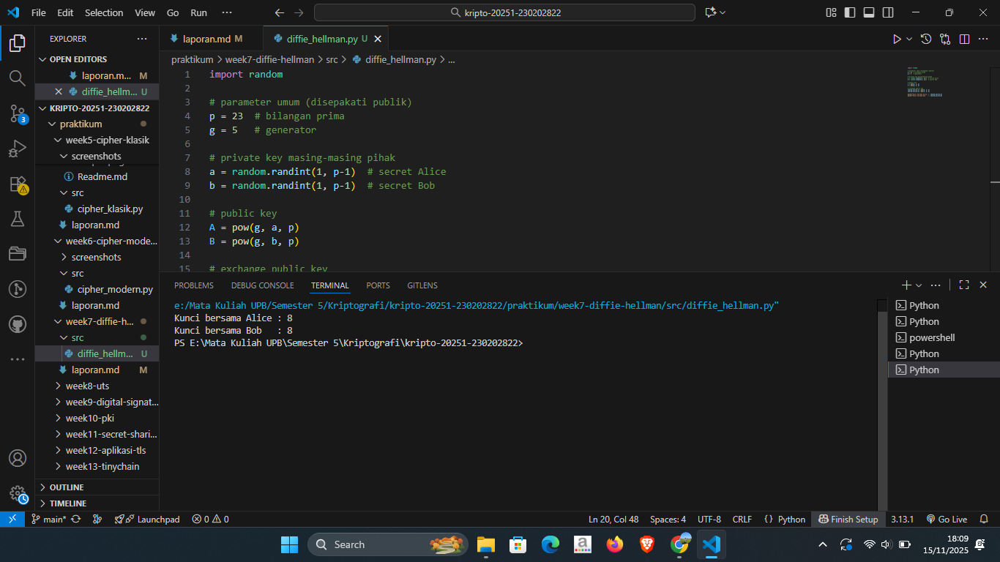

# Laporan Praktikum Kriptografi
Minggu ke-: 7  
Topik: [Diffiw Hellman]  
Nama: [Surya Subekti]  
NIM: [230202822]  
Kelas: [5IKRA]  

---

## 1. Tujuan
1. Melakukan simulasi protokol Diffie-Hellman untuk pertukaran kunci publik.
2. Menjelaskan mekanisme pertukaran kunci rahasia menggunakan bilangan prima dan logaritma diskrit.
3. Menganalisis potensi serangan pada protokol Diffie-Hellman (termasuk serangan Man-in-the-Middle / MITM).

---

## 2. Dasar Teori
Protokol Diffie–Hellman Key Exchange merupakan suatu mekanisme kriptografi yang memungkinkan dua pihak atau lebih untuk membentuk kunci rahasia bersama melalui media komunikasi yang tidak aman. Keunikan protokol ini adalah kemampuan menghasilkan kunci bersama tanpa perlu menukarkan kunci rahasia secara langsung, sehingga mengurangi risiko penyadapan selama proses distribusi kunci.

Secara konseptual, Diffie–Hellman memanfaatkan sifat perhitungan modulo pada bilangan prima besar dan konsep logaritma diskrit, yaitu operasi matematika yang secara komputasional mudah dilakukan ke satu arah, namun sulit dibalik tanpa informasi tambahan. Hal ini menjadikan kunci yang dihasilkan sangat sulit direkonstruksi oleh pihak tidak berwenang.

Dalam prosesnya, kedua pihak terlebih dahulu menyepakati dua parameter publik: sebuah bilangan prima besar (p) dan sebuah generator (g). Masing-masing pihak kemudian menghasilkan kunci privat yang tidak dibagikan kepada siapapun, dan dari kunci privat tersebut mereka membentuk kunci publik melalui operasi perpangkatan modulo. Setelah kedua pihak saling bertukar kunci publik, mereka dapat menghitung kunci rahasia bersama dengan menggunakan kunci privat masing-masing. Kunci rahasia yang diperoleh kedua pihak tersebut identik, meskipun mereka tidak pernah bertukar kunci privat.

Keamanan Diffie–Hellman bergantung pada sulitnya memecahkan Diffie–Hellman Problem, yaitu menentukan nilai kunci rahasia hanya berdasarkan informasi publik (g, p, dan kunci publik kedua pihak). Selain itu, protokol ini menjadi dasar bagi berbagai skema keamanan modern, seperti TLS/SSL, VPN, dan metode Perfect Forward Secrecy, yang memerlukan pembentukan kunci aman secara dinamis.

---

## 3. Alat dan Bahan
(- Python 3.x  
- Visual Studio Code / editor lain  
- Git dan akun GitHub  
- Library tambahan (misalnya pycryptodome, jika diperlukan)  )

---

## 4. Langkah Percobaan
(Tuliskan langkah yang dilakukan sesuai instruksi.  
Contoh format:
1. Membuat file `caesar_cipher.py` di folder `praktikum/week2-cryptosystem/src/`.
2. Menyalin kode program dari panduan praktikum.
3. Menjalankan program dengan perintah `python caesar_cipher.py`.)

---

## 5. Source Code

```python
import random

# parameter umum (disepakati publik)
p = 23  # bilangan prima
g = 5   # generator

# private key masing-masing pihak
a = random.randint(1, p-1)  # secret Alice
b = random.randint(1, p-1)  # secret Bob

# public key
A = pow(g, a, p)
B = pow(g, b, p)

# exchange public key
shared_secret_A = pow(B, a, p)
shared_secret_B = pow(A, b, p)

print("Kunci bersama Alice :", shared_secret_A)
print("Kunci bersama Bob   :", shared_secret_B)
```


---

## 6. Hasil dan Pembahasan
Hasil eksekusi program Diffie Hellman:




---

## 7. Jawaban Pertanyaan
1. Mengapa Diffie-Hellman memungkinkan pertukaran kunci di saluran publik?
    - Diffie–Hellman memungkinkan pertukaran kunci melalui saluran publik karena protokol ini tidak pernah menukarkan kunci rahasia secara langsung. Sebaliknya, kedua pihak hanya bertukar parameter publik (seperti g dan p) serta kunci publik hasil perpangkatan modulo. Keamanan proses ini didasarkan pada kesulitan komputasional dari masalah logaritma diskrit, yaitu menentukan nilai kunci privat dari kunci publik hampir mustahil dilakukan dalam waktu yang efisien.
    Dengan kata lain, meskipun pihak ketiga dapat melihat semua nilai yang dipertukarkan di saluran publik, mereka tetap tidak dapat menghitung kunci rahasia bersama, sehingga komunikasi tetap aman.
2. Apa kelemahan utama protokol Diffie-Hellman murni?
    - Kelemahan terbesar dari Diffie–Hellman murni adalah tidak adanya mekanisme autentikasi. Protokol ini hanya membangun kunci bersama, tetapi tidak memverifikasi identitas pihak yang terlibat.
    Akibatnya, penyerang dapat menyisipkan diri di antara dua pihak, memalsukan kunci publik, dan membangun dua kunci berbeda—satu dengan masing-masing pihak. Serangan ini dikenal sebagai Man-in-the-Middle (MITM).
3. Bagaimana cara mencegah serangan MITM pada protokol ini?
    - Serangan MITM dapat dicegah dengan menambahkan mekanisme autentikasi pada pertukaran kunci sehingga setiap pihak dapat memastikan bahwa kunci publik yang diterima benar-benar berasal dari lawan komunikasi yang sah. Autentikasi ini dapat dilakukan melalui tanda tangan digital, sertifikat digital (PKI), atau protokol yang sudah menggabungkan autentikasi seperti TLS dengan ECDHE. Dengan autentikasi tersebut, penyerang tidak dapat menyisipkan kunci publik palsu, sehingga pertukaran kunci menjadi aman.
    
---

## 8. Kesimpulan
Berdasarkan praktikum yang dilakukan, protokol Diffie–Hellman terbukti mampu menghasilkan kunci rahasia bersama meskipun proses pertukaran informasi dilakukan melalui saluran publik. Keamanan protokol ini bergantung pada kompleksitas logaritma diskrit, sehingga pihak ketiga tidak dapat dengan mudah menebak kunci privat. Namun, tanpa mekanisme autentikasi tambahan, Diffie–Hellman tetap rentan terhadap serangan Man-in-the-Middle, sehingga perlu diintegrasikan dengan protokol keamanan lain untuk menjamin identitas pihak yang berkomunikasi.

---

## 9. Daftar Pustaka
(Cantumkan referensi yang digunakan.  
Contoh:  
- Katz, J., & Lindell, Y. *Introduction to Modern Cryptography*.  
- Stallings, W. *Cryptography and Network Security*.  )

---

## 10. Commit Log
    week7-diffie-hellman

commit dcf1d18d2f65d61ec3203b699a1a4449ae0d56b0
Author: Surya Subekti <115227173+Ayrus27@users.noreply.github.com>
Date:   Sat Nov 15 18:11:55 2025 +0700

```
