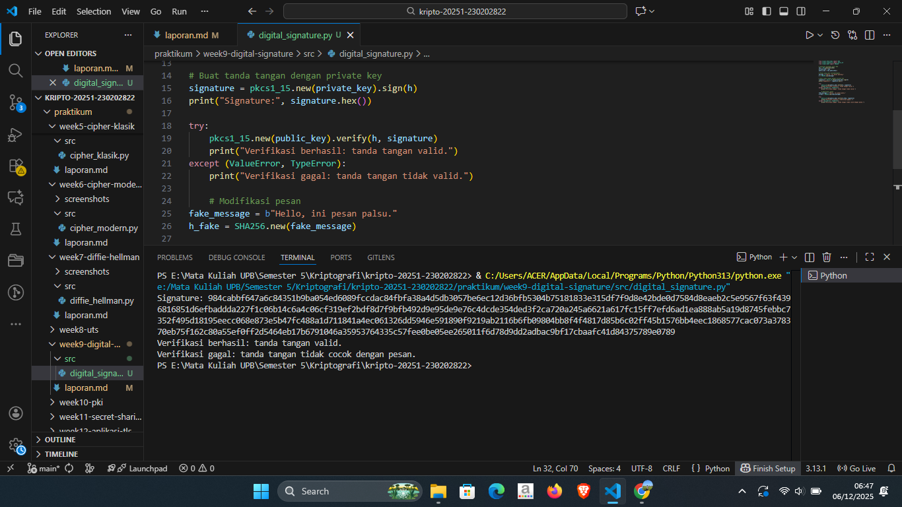

# Laporan Praktikum Kriptografi
Minggu ke-: 9  
Topik: [Digital Signature]  
Nama: [Surya Subekti]  
NIM: [230202822]  
Kelas: [5IKRA]  

---

## 1. Tujuan
- Mengimplementasikan tanda tangan digital menggunakan algoritma RSA/DSA.
- Memverifikasi keaslian tanda tangan digital.
- Menjelaskan manfaat tanda tangan digital dalam otentikasi pesan dan integritas data.(Tuliskan tujuan pembelajaran praktikum sesuai modul.)

---

## 2. Dasar Teori
Tanda tangan digital (digital signature) adalah mekanisme kriptografi yang digunakan untuk menjamin integritas, autentikasi, dan non-repudiation pada sebuah pesan atau dokumen digital. Konsep ini bekerja dengan prinsip matematika kriptografi kunci publik (public key cryptography), di mana proses penandatanganan dilakukan menggunakan kunci privat, sedangkan verifikasi dilakukan menggunakan kunci publik. Ketika sebuah pesan ditandatangani, sistem biasanya terlebih dahulu membuat hash dari pesan tersebut, kemudian hash tersebut dienkripsi menggunakan kunci privat pembuat tanda tangan. Hasil enkripsi inilah yang disebut sebagai digital signature.

Pada skema RSA Digital Signature, algoritma RSA dimanfaatkan bukan untuk enkripsi pesan, tetapi untuk melakukan proses sign–verify berbasis operasi eksponensial modular. Pengirim meng-hash pesan, lalu mengenkripsi hash tersebut menggunakan kunci privat RSA. Penerima kemudian mendekripsi tanda tangan menggunakan kunci publik untuk memperoleh hash yang asli. Jika hash tersebut identik dengan hash pesan yang dihitung ulang, maka validitas tanda tangan dapat dipastikan. RSA cenderung lebih sederhana dalam implementasi karena tidak memerlukan parameter acak setiap proses penandatanganan.

Berbeda dengan RSA, Digital Signature Algorithm (DSA) menggunakan komputasi pada domain bilangan diskrit dan modular exponentiation yang melibatkan parameter acak (nonce) pada setiap pembuatan tanda tangan. Keamanan DSA sangat bergantung pada kerahasiaan dan keunikan nilai nonce tersebut; jika nonce pernah bocor atau digunakan ulang, kunci privat dapat direkonstruksi. DSA lebih efisien dalam proses penandatanganan, sedangkan RSA biasanya lebih cepat pada proses verifikasi. Keduanya tetap menjadi standar internasional untuk memastikan keamanan komunikasi digital modern.

---

## 3. Alat dan Bahan
(- Python 3.x  
- Visual Studio Code / editor lain  
- Git dan akun GitHub  
- Library tambahan (misalnya pycryptodome, jika diperlukan)  )

---

## 4. Langkah Percobaan
(Tuliskan langkah yang dilakukan sesuai instruksi.  
Contoh format:
1. Membuat file `caesar_cipher.py` di folder `praktikum/week2-cryptosystem/src/`.
2. Menyalin kode program dari panduan praktikum.
3. Menjalankan program dengan perintah `python caesar_cipher.py`.)

---

## 5. Source Code

```python
from Crypto.PublicKey import RSA
from Crypto.Signature import pkcs1_15
from Crypto.Hash import SHA256

# Generate pasangan kunci RSA
key = RSA.generate(2048)
private_key = key
public_key = key.publickey()

# Pesan yang akan ditandatangani
message = b"Hello, ini pesan penting."
h = SHA256.new(message)

# Buat tanda tangan dengan private key
signature = pkcs1_15.new(private_key).sign(h)
print("Signature:", signature.hex())

try:
    pkcs1_15.new(public_key).verify(h, signature)
    print("Verifikasi berhasil: tanda tangan valid.")
except (ValueError, TypeError):
    print("Verifikasi gagal: tanda tangan tidak valid.")
    
    # Modifikasi pesan
fake_message = b"Hello, ini pesan palsu."
h_fake = SHA256.new(fake_message)

try:
    pkcs1_15.new(public_key).verify(h_fake, signature)
    print("Verifikasi berhasil (seharusnya gagal).")
except (ValueError, TypeError):
    print("Verifikasi gagal: tanda tangan tidak cocok dengan pesan.")
```


---

## 6. Hasil dan Pembahasan
Hasil eksekusi program Digital Signature:





---

## 7. Jawaban Pertanyaan
1. Apa perbedaan utama antara enkripsi RSA dan tanda tangan digital RSA?


2. Mengapa tanda tangan digital menjamin integritas dan otentikasi pesan?


3. Bagaimana peran Certificate Authority (CA) dalam sistem tanda tangan digital modern?


---

## 8. Kesimpulan
(Tuliskan kesimpulan singkat (2–3 kalimat) berdasarkan percobaan.  )

---

## 9. Daftar Pustaka
(Cantumkan referensi yang digunakan.  
Contoh:  
- Katz, J., & Lindell, Y. *Introduction to Modern Cryptography*.  
- Stallings, W. *Cryptography and Network Security*.  )

---

## 10. Commit Log
(Tuliskan bukti commit Git yang relevan.  
Contoh:
```
commit abc12345
Author: Nama Mahasiswa <email>
Date:   2025-09-20

    week2-cryptosystem: implementasi Caesar Cipher dan laporan )
```
